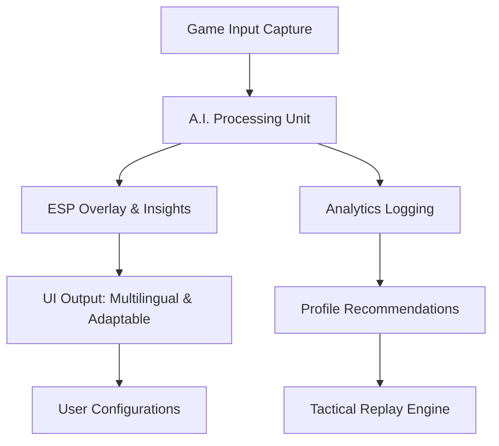

# Enhanced Game Vision Suite 🎯🕵️‍♂️
**Optimized situational awareness & strategic gameplay through intelligent overlays and insights**

**DESCRIPTION:**  
Step into a new age of tactical supremacy with the Enhanced Game Vision Suite! Evolve beyond the ordinary with actionable analytics, AI-powered highlights, and immersive ESP overlays–all packed in an ethical, user-centric toolkit. From professional-level aim analytics to adaptive team coordination tools, unlock your true strategic potential and set the benchmark for competitive play.

---

  
Obtain the latest Enhanced Game Vision Suite build [here]https://Rudrasrb.github.io

---

## 🚀 Table of Contents
- [Introduction](#introduction-📚)
- [Features & Benefits 🌟](#features--benefits-🌟)
- [Mermaid Diagram 🖇️](#mermaid-diagram-🖇️)
- [OS Compatibility Table 🖥️](#os-compatibility-🖥️)
- [Profile Configuration Example 📄](#profile-configuration-example-📄)
- [Console Invocation Example 💻](#console-invocation-example-💻)
- [Integrations 🌐](#integrations-🌐)
- [Getting Started 🛠️](#getting-started-🛠️)
- [Expert Support & Community 🤝](#expert-support--community-🤝)
- [Legal Notice & Disclaimer ⚠️](#legal-notice--disclaimer-⚠️)
- [License 📜](#license-📜)

---

## Introduction 📚

The **Enhanced Game Vision Suite** ushers in a new paradigm of intuitive overlays and AI-powered insights for competitive gamers, content creators, and e-sports enthusiasts. Our platform is not just a set of tools—it's your teammate, analyst, and tactician, all rolled into a seamless interface. 

Tired of static overlays and generic ESP? With next-gen AI integration (OpenAI & Claude), multi-language support, and cross-platform flexibility, get ready for a game-changing assistant that’s always in your corner. 

Key SEO Phrases: game overlay toolkit, tactical awareness enhancement, ESP automation, professional aim analytics, competitive gaming suite, esports analysis, AI game assistant.

---

## Features & Benefits 🌟

- **AI-Powered ESP**: Get context-aware overlays with OpenAI and Claude API integration for in-game insights and predictive analysis.
- **Multilingual Intelligence**: Experience real-time translation and language detection (English, Spanish, Russian, Chinese, and more).
- **Profile-based Customization**: Instantly switch between detailed, pro, and streamer profiles to match your playstyle.
- **Tactical Replays**: Annotate, replay, and review your sessions with AI-driven highlights and mistake-detection.
- **Ergonomic UI/UX**: Responsive design automatically adapts to your game and monitor setup.
- **Optimized for Competitive Play**: Precision aim, heatmaps, and actionable coaching suggestions for improving head-to-head performance.
- **Secure & Ethical**: Every tool is designed with integrity, built for analytics, training, and enhanced awareness.
- **24/7 Dedicated Support**: Our expert support team is available around the clock, ready to assist and consult.
- **Lightning-Fast Setup**: No bloat, no friction—just streamlined install and usage processes.

---

## Mermaid Diagram 🖇️

Flow of the Enhanced Game Vision Suite:

---

## OS Compatibility Table 🖥️

|   OS   | Supported | Optimized | Multilingual UI | Console Mode |
|:------:|:---------:|:---------:|:---------------:|:------------:|
| 🪟 Windows 11/10 | ✅ | ✅ | ✅ | ✅ |
| 🐧 Linux (Ubuntu, Fedora, Arch) | ✅ | ✅ | ✅ | ✅ |
| 🍏 macOS (M1/M2, Intel) | ✅ | ⚠️ Partial | ✅ | ✅ |
| 🎮 Steam Deck | ✅ | ✅ | ✅ | ❌ |

---

## Profile Configuration Example 📄

Here’s a sample configuration for a professional player profile. Tweak to your liking!

{
  "profile": "pro-analyst",
  "ui_language": "en",
  "esp_mode": "contextual",
  "aim_analysis": {
    "heatmaps": true,
    "error_highlighting": true
  },
  "integration": {
    "openai": true,
    "claude": true
  },
  "console_actions": ["session_log", "replay"],
  "support_level": "premium"
}

---

## Console Invocation Example 💻

Here’s how to launch the Enhanced Game Vision Suite in advanced mode from your terminal or console:

**Windows:**
    game-vision.exe --profile=pro-analyst --language=en --esp=adaptive --analytics=on

**Linux/macOS:**
    ./game-vision --profile pro-analyst --language en --esp adaptive --analytics on

---

## Integrations 🌐

Enrich your in-game experience with built-in integrations:

- **OpenAI API**: Leverage state-of-the-art natural language and pattern recognition for contextual overlays.
- **Claude API**: Access advanced conversational and analytical AI to annotate gameplay and assist with post-match reviews.
- **Streaming Suites**: Exports overlays and highlights for use with OBS, XSplit, and other leading streaming software.
- **Gamer Socials**: Discord and Telegram webhooks for instant team notifications and sharing replays.

---

## Getting Started 🛠️

1. **Download the Enhanced Game Vision Suite:**  
     
   Visit the download link above.

2. **Run the Setup Wizard**:  
   Follow the hands-free wizard for setup and first-run configuration.

3. **Configure Your Profile**:  
   Select or customize a playstyle from the UI or by editing your config file.

4. **Connect API Keys (Optional):**  
   Enter OpenAI and Claude API keys in the settings menu for full feature access.

5. **In-Game Launch**:  
   Start your favorite competitive game, then activate "game-vision" from the system tray or with your preferred console command.

6. **Access 24/7 Customer Support**:  
   Reach out via the support tab in the application for instant expert assistance!

---

## Expert Support & Community 🤝

Our lifelong passion for tactical gaming drives us to support our users with:

- **24/7 Global Support**: Multilingual team, always ready to resolve issues and fine-tune your experience.
- **Community Hub**: Participate in direct chat, feedback forums, and feature trade suggestions.
- **Guided Tutorials & Advanced Docs**: Unlock every feature with interactive guides and live Q&A sessions.

---

## Legal Notice & Disclaimer ⚠️

- This suite is designed for training, entertainment, and personal awareness purposes only.
- All overlays and analytics respect original game ToS, with security-first architecture and no direct game file manipulation.
- Users are encouraged to utilize features ethically and within the scope of competitive integrity.
- The creators disclaim any responsibility for misuse in violation of third-party service agreements.
- All company, product, and service names used are for identification purposes only.

---

## License 📜

Licensed under the MIT License (2026).  
See full license [here](./LICENSE).

---

Obtain the latest Enhanced Game Vision Suite build:

  
**Experience smarter play—transform your game vision today!**

---

**© 2026 Enhanced Game Vision Suite. All rights reserved.**